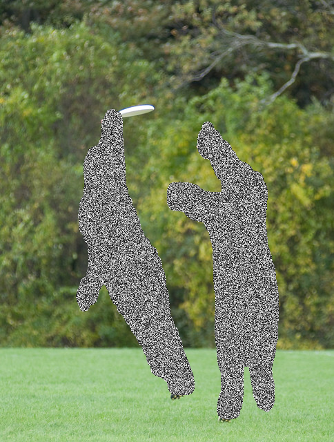

# Event description

This project is part of:  
[in_cognitive TechDay Wrocław](https://www.facebook.com/events/703140230184855/)

### Hosted by:
  [intive](https://www.intive.com/)  
  

### Workshop is conducted by:  
Błażej Matuszewski  | [github](https://github.com/bwosh) | [linkedin](https://www.linkedin.com/in/blazejmatuszewski/) | [twitter](https://twitter.com/bm4tu)

# Project Description

*Computer Vision in PyTorch Workshop*  
is dedicated to beginner-level AI developers.  

[Notebook](./notebook.ipynb) shows how to perform inference on pre-trained model in PyTorch to get masks of people and censor them like this: 

